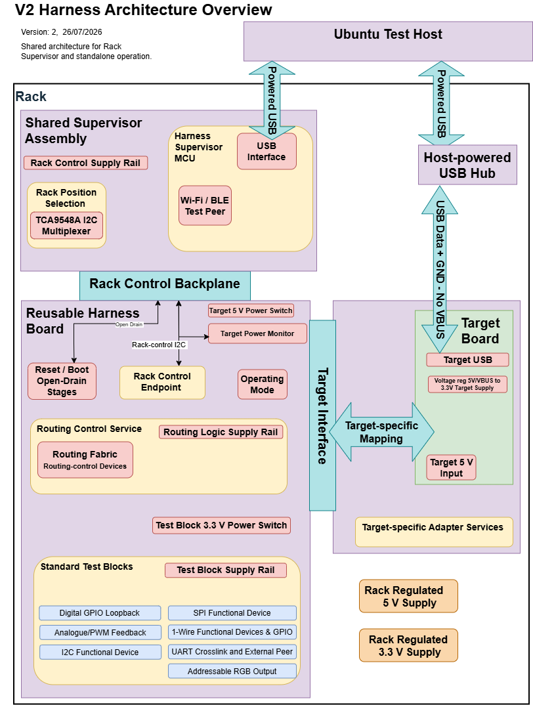
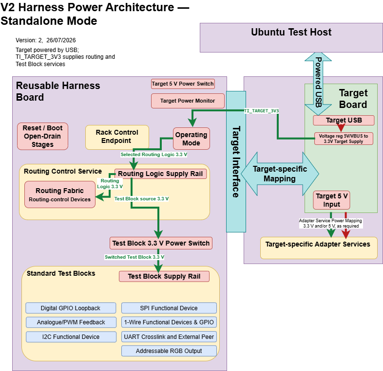
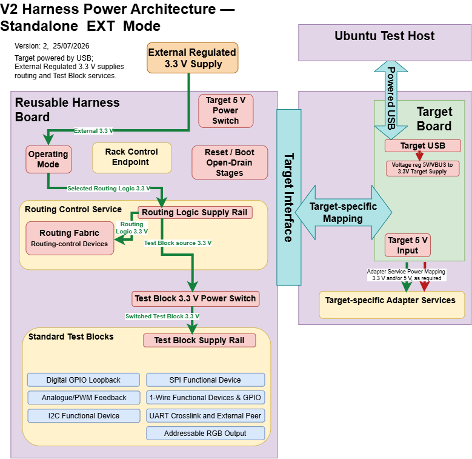
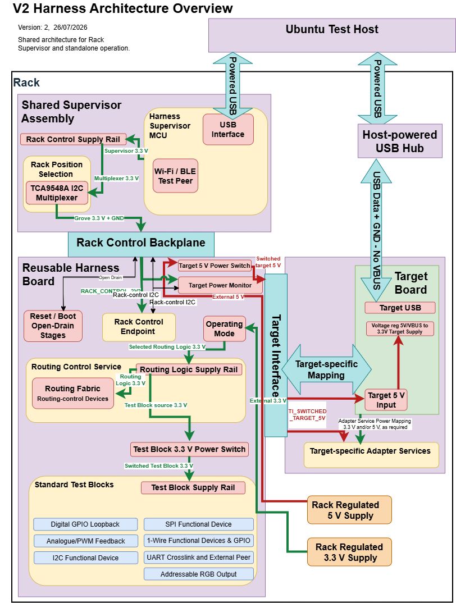

# V2 Standard Control Services

**Status:** Accepted

**Version:** 0.1

**Last Updated:** 26 July 2026

## 1. Purpose

This document defines the reusable services used to configure, operate,
observe and recover the V2 harness system. It covers Power Control,
host-facing target control, console and firmware flashing, direct reset and
boot, Routing Control, and the minimum Harness Supervisor services needed for
recovery, sleep/wake, Wi-Fi and Bluetooth Low Energy (BLE) testing. It also
defines the prototype rack arrangement in which one Supervisor serves up to
eight independent rack positions.

The standard harness shall remain useful in a **Standalone** mode without a
**Harness Supervisor**. A Supervisor adds unattended control and recovery but
is not required for Standalone testing.

This document defines behaviour and practical system boundaries. Component
selection, detailed circuits and physical Target Interface contacts remain
downstream design work.

## 2. Control-Service Principles

Control Services shall start in electrically safe states without depending on
target or Supervisor software. A defined hardware reset or recovery action
shall return controlled routes to their safe states and shall not leave a
competing driver or uncontrolled target supply.

The Target Profile shall state which services and owners are available. The
Resolved Test Configuration shall record the selections and observed states
needed to reproduce a test.

Target-specific USB, supply, polarity or protection arrangements are Adapter
Services on the target daughter board or documented harness accessories. They
shall not be duplicated on the reusable harness merely to accommodate one
target.

## 3. Power Control Service

### 3.1 Architecture

One grouped **Operating Mode** header coordinates the Routing Logic Supply
Rail source, Test Block power-switch selection and harness target-power
control. The header accepts one shunt in one of four clearly marked positions:

| Mode | Routing Logic Supply Rail | Test Block Supply Rail | Target power from harness |
|---|---|---|---|
| `OFF` | Off | Off | Off |
| `STANDALONE` | Target 3.3 V | On | Off; normal powered USB is used |
| `STANDALONE EXT` | External 3.3 V | On | Off; normal powered USB is used |
| `SUPERVISOR` | External 3.3 V | Supervisor-controlled, default off | Supervisor-controlled 5 V |

These Operating Mode header positions are physical power-configuration
preconditions, not test-facing capability modes. Tests still request
capabilities through the Target Support Module and record the resulting
Resolved Test Configuration.

`OFF` removes harness-provided routing, Test Block and target power. It does
not disconnect a target that is independently powered through an ordinary USB
cable or another external connection. A target that must be fully unpowered
shall have those competing sources removed or use the defined USB No-VBUS
connection.

This removes invalid user-selected combinations while retaining externally
powered Standalone operation for development, diagnosis or a target with
insufficient spare 3.3 V capacity. The grouped-header implementation shall be
confirmed during schematic design.

The target owns the direct routing-control I2C in both Standalone and
Supervisor operation. Operating Mode selection does not switch I2C ownership.

*Figure 1 — Common V2 harness architecture. This view shows functional
boundaries rather than physical connector assignments. The
[canonical draw.io source](diagrams/rack-architecture-overview.drawio)
generates this and the mode-specific power views.*

Target-specific Adapter Services may use target-local 3.3 V and/or 5 V where
their implementation requires it. This optional daughter-board power mapping
does not define additional mandatory Target Interface rails; the daughter-board
schematic and Target Profile shall identify the actual sources and loads.

### 3.2 Routing-Control 3.3 V

The Routing Logic Supply Rail shall accept either target 3.3 V or an external
regulated 3.3 V harness-system supply. The Operating Mode header shall select
one source without allowing the two supplies to be connected together.

The daughter board supplies target 3.3 V through the Target Interface on the
provisional `TI_TARGET_3V3` signal, with the common ground reference. It is an
output from the powered target into the harness mode selection, not a general
bidirectional 3.3 V rail or a target power input. Physical contact allocation
remains part of the Target Interface contract.

`TI_TARGET_3V3` shall also remain available as a bounded, low-current target
I/O-domain reference whenever the target is powered. When the Operating Mode
selection disconnects it from the Routing Logic Supply Rail, the reference may
serve only approved loads such as target-side I2C pull-ups and target-domain
power-valid qualification. It shall not be connected to the external 3.3 V
source.

In `STANDALONE`, the target 3.3 V rail is expected to be established before
test code executes. Routing devices shall nevertheless enter their safe state
in hardware while the target starts. A Target Profile shall require
`STANDALONE EXT` where target 3.3 V is unavailable or cannot supply the
complete harness load.

The selected source powers the Routing Logic Supply Rail directly. The Test
Block Supply Rail is derived from it through a controlled power switch. It is
on in both Standalone modes so active Test Blocks remain available without a
software power-enable step. In `SUPERVISOR` it defaults off and is enabled only
when required. Passive Test Block connections do not require this rail.

The Operating Mode is a test precondition and shall not be changed while any
associated source is powered.

### 3.3 Standalone Operation

Standalone operation uses the target's normal powered USB connection for
power, firmware flashing and console access. The target establishes and verifies
the required routes through the direct routing-control I2C.

*Figure 2 — Active `STANDALONE` power routes. Powered USB supplies the target;
the target returns `TI_TARGET_3V3` to the Operating Mode selection, which
supplies the Routing Logic and Test Block rails. The target 5 V switch and
input remain visible as parts of the common architecture but are inactive.*

Automated power cycling is unavailable in this arrangement. Tests that require
it shall be excluded, adapted to a manual step or run later with a Supervisor.
Recovery uses the target's normal reset, boot and USB power controls.

The routing fabric shall not be needed to establish the control bus or the
normal recovery connection. This prevents an incorrect route from blocking
the means required to correct it.

### 3.4 Standalone External Operation

`STANDALONE EXT` retains the normal powered USB connection to the target but
uses an external regulated 3.3 V harness-system supply for the Routing Logic
Supply Rail. The Operating Mode selection disconnects `TI_TARGET_3V3` from
that rail, selects the external source and holds the Test Block 3.3 V power
switch on. The target remains the owner of the direct routing-control I2C.

*Figure 3 — Active `STANDALONE EXT` power routes. Powered USB supplies the
target; an external regulated 3.3 V source supplies Operating Mode, Routing
Logic and Test Block services. `TI_TARGET_3V3` is disconnected as a harness
supply source but remains a bounded target I/O-domain reference;
harness-switched target 5 V is inactive.*

This mode shall be used when the target does not expose a 3.3 V output capable
of supplying the complete routing and Test Block load, cannot supply that load
within its rating, or must remain electrically independent of it. The external
source may be a standalone bench supply or the regulated 3.3 V harness-system
supply used by a rack, but it shall share the defined ground reference and
shall not be connected to the target's low-current 3.3 V reference.

Target power cycling remains unavailable because ordinary powered USB still
supplies the target. Evidence shall distinguish `STANDALONE EXT` from
`STANDALONE` and record the external 3.3 V source and measured rail state.

### 3.5 Supervisor-Controlled Target Power

Supervisor operation shall provide a switched 5 V target supply while keeping
the Supervisor and routing-control domain powered. The Supervisor shall be
able to remove target power, confirm the target supply state and restore power
without assistance from target firmware. The routing-control circuitry shall
be arranged so the same reset or recovery operation also returns controlled
routes to their hardware safe state; Supervisor access to the routing-control
I2C is not required.

In rack operation, the common external 5 V supply is distributed to an
independent target-power switch on each harness board. The Supervisor selects
the rack position through the TCA9548A and writes that harness's Rack Control
MCP23008. One MCP23008 output controls the local switch enable; target current
does not pass through the expander. External biasing holds the switch off
before the endpoint is configured or whenever its control is unavailable.

Each harness board shall also provide a Supervisor-owned **Target Power
Monitor** on its existing rack-control I2C branch. The monitor shall be powered
from `RACK_CONTROL_3V3` so it remains available while target power is off. It
shall observe the switched target-power path downstream of the power switch
and before that path divides between the Target Board and Target-specific
Adapter Services. Its bus-voltage measurement shall provide the observed
target-power state, and it shall also report target-position current and
power.

The Target Power Monitor shall support useful measurements of both normal
operating consumption and low-power or sleep consumption. A monitor such as
the [INA226](https://www.ti.com/product/INA226) is a prototype candidate, but
the selected device, shunt value and any selectable measurement ranges shall
be demonstrated to cover the required peak-current and sleep-current range.
The monitor shares the existing
TCA9548A-selected SDA and SCL connection with the MCP23008; it does not add
another I2C backplane or additional backplane conductors.

The Hackaday.io article
[Mastering the INA219 & INA226](https://hackaday.io/project/204686-mastering-the-ina219-ina226/details)
provides non-normative background on shunt selection, high-side sensing,
Kelvin connections, filtering and averaging. Component limits and final
design requirements shall be taken from the manufacturer's data sheet and
verified by prototype measurement.

The Power Control Service provides the switched 5 V supply. The daughter board
maps that supply from a dedicated logical Target Interface power-service
connection, provisionally `TI_SWITCHED_TARGET_5V`, to the target's accepted
`5V`, `VBUS`, `VSYS` or target-specific power input. This connection is an
output from the harness to the daughter board, not a general bidirectional 5 V
rail. Physical contact allocation remains part of the Target Interface
contract.

The daughter-board mapping shall not bypass a target's intended onboard
regulation or connect the switched supply to host USB VBUS or another active
source. In Standalone operation this path remains inactive while the normal
powered USB connection supplies the target. Appendix A records the
supplier-documented external-power connection for each assessed target.

*Figure 4 — Active `SUPERVISOR` power routes. The rack supplies independent
3.3 V routing power and switched 5 V target power. The host connection to the
target carries USB data and ground with no VBUS.*

The switching and monitoring implementation shall provide adequate current
capacity, reverse-current protection, acceptable shunt and switch voltage
drop, and predictable removal of residual target-rail charge. Exact ratings,
measurement ranges, accuracy, sensing thresholds and circuit topology remain
detailed design decisions.

### 3.6 Host USB During Controlled Power Cycling

The harness system normally uses a host-powered local USB hub. Short, marked
cables connect the hub to the target USB ports. A **USB No-VBUS Cable** passes
USB data and ground but has no VBUS power connection. It therefore
prevents the host or hub from becoming a competing target-power source.

The USB hub and USB No-VBUS Cables are harness-system equipment, not circuitry
repeated on every daughter board. A target-specific USB interposer is an
Adapter Service only where a USB No-VBUS Cable is insufficient.

For the prototype, a USB-A male screw-terminal adapter at the hub end provides
a simple reusable construction method. A target cable can retain its moulded
target connector while its USB-A end is removed; data and ground connect at
the adapter and VBUS remains disconnected. This keeps the bulky termination at
the hub and permits different target connectors and cable lengths. The
following off-the-shelf adapter is a candidate rather than a fixed component
selection: `https://www.amazon.co.uk/dp/B0CM65GY89`. Each completed cable shall
be continuity-tested and marked `USB NO VBUS`; USB-C cables require separate
attach-detection validation.

The initial ESP32-S3 arrangement may use externally powered native USB while
the host remains connected. Standards-compliant self-powered USB attach and
detach sensing is not an initial harness capability; it may be added later as
an S3-specific Adapter Service if that behaviour needs to be tested.

ESP32-S3 USB OTG host operation additionally requires the target to supply
VBUS to the attached USB device. Its daughter board shall therefore provide an
optional, controllable VBUS Adapter Service supplied from the harness switched
5 V service. The VBUS output shall default off and prevent reverse current; it
is enabled only when the target is deliberately operating as the USB host.
The switch, current protection, control path and connector arrangement remain
daughter-board design decisions. An ordinary USB No-VBUS Cable supports the
normal device-mode host connection but does not provide this OTG-host supply.

USB VBUS isolation alone does not prove that a target is unpowered. Prototype
verification shall also check USB data, control I2C, routing, reset, debug,
wake and handshake connections for back-power paths.

### 3.7 Evidence And Verification

Power-related test evidence shall record the Operating Mode, target power
source, relevant USB No-VBUS Cable connections and Test Block Supply Rail
state. Supervisor-controlled tests shall record both the commanded and
observed target-power state. They shall also record target-position voltage,
current and power measurements where required by the test, including the
settled sleep-current measurement for a low-power test.

The prototype shall demonstrate:

1. safe Standalone startup with routing powered from target 3.3 V
2. safe `STANDALONE EXT` operation with target-controlled routing from the
   external 3.3 V source and no connection to target 3.3 V
3. controlled enable and removal of the Test Block Supply Rail
4. safe routing and peripheral states during target power removal
5. supervised removal and restoration of target 5 V
6. absence of material back-power through every attached path
7. restoration of the selected console or USB connection after power cycling
8. target-position current measurement across the accepted operating and
   sleep-current ranges

### 3.8 Downstream Decisions

Detailed design shall select the grouped Operating Mode header circuit, 3.3 V
source connector, Test Block and target-power switches, supply ratings,
Target Power Monitor, shunt arrangement, measurement ranges, discharge
behaviour and protection components. Prototype measurements shall demonstrate
the required peak-current and sleep-current coverage and determine whether any
target requires USB data isolation in addition to the VBUS disconnection in
its USB No-VBUS Cable.

Physical Target Interface contacts are not assigned by this specification.

## 4. Target Control, Console And Firmware Flashing

This service provides the host-facing **endpoints** used to prepare, run,
observe and recover target tests. An endpoint is a distinct communication
connection between the host and target, such as USB, UART or a wireless
console, that can provide one or more service roles. Through these endpoints,
**Test Control** sends JavaScript tests through the REPL and collects their
results, while **Console** provides interactive REPL and diagnostic access.
**Firmware Flashing** installs the selected firmware build, and **Recovery**
restores flashing or console access when the runtime is unavailable. These
services remain independent of the Test Block routing fabric and the
capability under test.

Every selected test configuration shall identify one direct host-facing
test-control endpoint. The Target Profile declares the legal endpoints; the
Resolved Test Configuration selects the endpoint used for that run.

### 4.1 Roles And Ownership

One physical endpoint may provide several logical roles:

| Role | Purpose |
|---|---|
| Test Control | Sends JavaScript tests through the REPL and collects their results |
| Console | Provides interactive REPL and diagnostic access |
| Firmware Flashing | Installs the selected firmware build on the target |
| Recovery | Restores firmware-flashing or console access when the runtime is unavailable |

The host runner owns the selected target endpoint. The Harness Supervisor uses
its own USB connection. The host connects directly to the target for console
access and firmware flashing without involving the Supervisor. Only one host
process or tool shall own a physical endpoint at a time.

The selected path shall be direct or target-specific. It shall not depend on a
Test Block route that target firmware must first establish, because the host
may need the path before routing is configured or to recover from firmware or
routing failure. Hardware-debug probes remain host-coordinated Adapter
Services rather than reusable harness hardware.

Where an endpoint and a Test Block share target pins, the connection matrix
shall define mutually exclusive paths with a safe disconnected default. The
selected test-control endpoint shall remain independent of the route under
test.

### 4.2 Path Selection

In both Standalone modes, the normal powered target USB or documented
alternative provides the host-facing path. In `SUPERVISOR`, the host still
connects directly to the target, normally through the configured USB No-VBUS
connection while harness-switched 5 V powers the target. `OFF` does not
disconnect an independently powered host connection.

The Target Profile shall identify each available endpoint, its supported
roles, power behaviour, firmware dependencies, conflicts and required
preconditions. When the normal endpoint is itself under test, an independent
alternative shall be selected. If none is available, that capability is
unavailable rather than failed.

A target with multiple USB, UART, debug or wireless paths shall give each a
stable logical role. Rack configuration additionally maps each selected USB
role to the stable Linux path defined in Section 8.5.

### 4.3 Safety, Recovery And Evidence

No connection used for test control, console, firmware flashing or debug may
back-power an unpowered target or compete with another driver. USB No-VBUS
removes one supply path but does not replace powered-off validation of USB
data, UART, I2C, debug and other attached signals.

Firmware flashing shall have exclusive use of its endpoint. If the runtime path
fails, recovery shall use the declared direct reset, boot, power-cycle,
ROM-loader or debug path rather than an unverified Test Block route. After
flashing or recovery, the host shall verify the expected target and firmware
identity where the runtime permits.

Evidence shall record the selected logical role and endpoint, Operating Mode,
target power source, stable host identifier, connection power state,
preconditions, ownership changes and observed target and firmware identity.
Exact connectors, target-specific adapters, host software and Target Profile
storage format remain downstream decisions.

## 5. Direct Reset And Boot Control

This service provides the direct target controls used to restore a known
execution state and, where supported, select a firmware-flashing mode. It
enables the test system to restart an unresponsive target, enter its ROM or
board bootloader and perform repeatable reset and boot tests without depending
on responsive target firmware or the Test Block routing fabric.

**Reset Request** asserts the target's reset or enable input. **Boot Request**
is an optional condition applied with reset or power-up to select a target
bootloader or other recovery mode. Target power cycling remains the separate
Power Control Service defined in Section 3.

### 5.1 Controls And Ownership

| Control | Purpose |
|---|---|
| Reset Request | Forces a direct hardware reset and returns the target to its normal boot path |
| Boot Request | Selects a target-specific bootloader or recovery path during reset or power-up |

The host runner owns the reset or boot operation. In `SUPERVISOR`, the Harness
Supervisor performs the requested action through the Supervisor Interface and,
in rack operation, the selected Rack Control Endpoint. In either Standalone
mode, the host uses the target's supported automatic sequence or the operator
uses the declared manual controls.

A host endpoint may provide the same logical controls through a target-provided
automatic sequence, such as USB-UART DTR/RTS driving onboard reset and boot
circuitry. The Target Profile shall describe this as an endpoint capability
rather than a separate Control Service.

The provisional `TI_TARGET_RESET_N` service is an active-low open-drain
control that defaults released. The optional provisional `TI_BOOT_REQUEST`
service is asserted by pulling its open-drain Interface control low and is
otherwise released. The target daughter board provides any inversion, level
adaptation, protection or isolation needed by the target.

Onboard automatic-download circuits, debug probes, manual controls and harness
controls may share a target reset or boot node only when their inactive states
are compatible and no source can oppose another. Neither control shall depend
on target-controlled I2C or a Test Block route.

### 5.2 Modes And Target Options

In `OFF`, harness-driven reset and boot controls remain inactive, although an
independently powered target may still respond to its onboard controls. Both
Standalone modes retain the target's documented manual or host-endpoint
sequence. `SUPERVISOR` adds automated reset and optional boot sequencing
without changing their target-side meaning.

Direct reset is available when the target exposes a safe reset or enable
input. Boot Request is optional because boot polarity, sampling and onboard
download arrangements differ between targets. A target without a safe direct
reset mapping shall declare another recovery action, such as controlled power
cycling, ROM USB or a debug adapter.

The Target Profile shall state the available controls, their daughter-board
mappings, active polarity, timing, power dependencies, onboard circuit
interactions and supported Operating Modes. It shall also identify any manual
action or connection precondition.

### 5.3 Sequencing, Safety And Evidence

A normal reset shall leave Boot Request inactive, assert Reset Request for the
target's required minimum interval, release it and wait for the selected
control endpoint to return. The host shall then verify the expected target and
runtime identity.

A firmware-flashing boot sequence shall assert Boot Request, perform the
target-defined reset or power-up sequence, then release Boot Request at the
time declared by the Target Profile. After flashing, the service shall restore
the normal boot state, restart the target and verify the expected runtime where
the endpoint permits.

Reset and Boot Request shall default inactive before software configuration,
during Supervisor loss and while the relevant control circuitry is unpowered.
They shall not back-power the target, disturb unsafe strapping states or leave
the target held in reset or bootloader mode after a failed operation.

Evidence shall record the requested action, owner, Operating Mode, target
power state, asserted controls, configured timing, observed endpoint
disconnection or return, resulting boot mode and final target and firmware
identity. Exact circuits, physical Target Interface contacts and target-specific
adaptation remain downstream decisions.

## 6. Routing Control Service

This service controls the electronic switches on the reusable harness board
that connect target GPIO signals to Standard Test Blocks. This capability
allows a target GPIO to be reused for different Test Blocks from one test
configuration to another. It also allows the same fixed Test Blocks to support
targets with different GPIO and hardware-peripheral assignments, without
manually rewiring the harness.

A **target routing connection**, called a **route entry** in the Target Routing
Envelope, carries one target GPIO signal through the Target Interface into the
Routing Fabric. **Route Selection** uses route-selection switches to connect
those entries to predefined Test Block signals.

**Block-local connection switching** controls switches inside a Test Block
after the target signals have reached it. For example, Block 7 selects whether
its protected UART endpoints are cross-connected for a two-UART test,
connected to an external peer, or isolated.

Before a test, the service automatically applies and verifies the complete
switch configuration that connects the selected target pins to the required
Test Block. After the test, it clears those connections.

**Routing-control devices** are the I2C-controlled expanders and switches that
implement these paths. Route Selection and Block-Local Connection Switching
remain distinct logical functions even where they share an I2C controller.
The Target Profile declares the legal configurations; the Resolved Test
Configuration records the complete configuration selected for a test.

### 6.1 Functions And Ownership

| Function | Purpose |
|---|---|
| Route Selection | Connects target route entries to their legal Test Block destinations using route-selection switches |
| Block-Local Connection Switching | Selects a Test Block's predefined internal connection arrangement |
| State Verification | Reads back the commanded routing-control state |
| Hardware Clear | Returns every controlled path to its safe inactive state without target firmware |

The target is the software owner of the Routing Control Service in every
powered Operating Mode. The host requests a logical capability through the
target's Test Control endpoint, and the Target Support Module applies and
verifies the resolved configuration. The Harness Supervisor does not own the
target routing-control I2C or select arbitrary routes.

Routing control uses the mandatory direct `TI_I2C_SDA` and `TI_I2C_SCL`
connections. The bus shall be usable before any Test Block route is configured
and shall remain independent of the path it controls. The Supervisor may
invoke Hardware Clear through a direct control, but it does not require access
to the routing-control I2C.

The direct bus crosses independently powered target, Routing Control Service
and Standard Test Block domains. The reusable harness shall therefore provide
the two fixed, power-qualified SDA/SCL isolation boundaries specified by
`I2CControlledRouting_V2.md`. These boundaries are infrastructure and are not
software-selected routes.

### 6.2 Modes And Configuration Options

In `OFF`, routing-control power is removed and every controlled path shall
remain in its safe inactive state. In `STANDALONE`, target 3.3 V powers the
Routing Logic Supply Rail; in `STANDALONE EXT` and `SUPERVISOR`, the external
regulated 3.3 V source powers it. The target remains the routing owner in all
three powered modes.

In `SUPERVISOR`, the Routing Logic Supply Rail remains powered while target
power is cycled. Hardware Clear establishes the safe routing state before the
target starts or is removed, and target firmware establishes the selected
configuration after startup.

The [accepted Target Routing Envelope](TargetRoutingEnvelope_V2.md) defines the
common R0-R6 route-entry minimum, legal direct alternatives and required
simultaneous configurations. A Target Profile may therefore use the common
routed form, direct Test Block paths or a reviewed combination of both. It
shall declare the legal route sets, block-local selections, conflicts,
exclusive reuse and unavailable capabilities. The service does not provide an
arbitrary crosspoint matrix.

### 6.3 Sequencing, Safety And Evidence

A route change shall use this safe order:

1. place affected target and peer drivers in their inactive or high-impedance
   states
2. clear connections that conflict with the requested configuration
3. apply the complete legal route and block-local selection
4. read back and verify the commanded state
5. enable target or Test Block drivers only after verification
6. disable drivers, clear the configuration and verify the safe state after
   the test

An invalid or incomplete configuration shall be rejected before any driver is
enabled. Controlled paths shall default high impedance before software
configuration, during reset and after Hardware Clear. No configuration may
connect two active outputs, apply more than one active source to an input,
leave conflicting direct and routed paths enabled or back-power an unpowered
target. Target boot, strap, console and recovery signals shall remain safe
throughout route changes.

A hardware clear associated with reset or recovery shall return routing and
block-local switches to their safe state without target I2C activity.
Controller readback confirms the commanded control state; prototype
continuity and electrical tests verify that the physical path implements it.

Evidence shall record the Target Profile revision, requested logical
capability, resolved route and block-local selections, control writes,
readback, safe state before and after the test, and any rejected or failed
operation. Exact switch topology, components, I2C addresses, register map,
physical Target Interface contacts and signal-integrity limits remain owned by
the routing specification, connection matrix and schematic work.

## 7. Harness Supervisor

The optional **Harness Supervisor** is a removable, independently powered MCU
board that executes host-requested Control Service operations when they cannot
depend on responsive target firmware. It connects to the host through USB and
to each controlled harness through its Supervisor Interface, either directly
or through the Rack Control Backplane defined in Section 8. Its absence does
not prevent Standalone operation.

The Supervisor is a recovery controller and a defined test peer, not a
general-purpose instrumentation platform or routing controller.

A typical supervised test uses this workflow:

1. The host selects the Resolved Test Configuration and sends the next
   **service request**, such as position selection, power control or recovery,
   to the Supervisor.
2. The Supervisor performs the action through the selected Rack Control
   Endpoint and returns its command state, local **observations** and
   timestamps to the host.
3. After the target endpoint is available, the host starts the test directly
   on the target. The target establishes its required routes and executes the
   test.
4. During the test, the host may request a Supervisor event or wireless-peer
   action. The Supervisor returns the corresponding feedback while the target
   independently returns its **test result**.
5. The host correlates the target result with the Supervisor observations,
   records the complete result and requests the safe inactive state.

### 7.1 Responsibilities And Limits

The Supervisor shall:

* control the Test Block Supply Rail and operate target power, reset and
  optional boot recovery
* operate one two-signal event handshake for sleep/wake and wireless tests
* provide Wi-Fi and BLE functional-test peers
* return a structured result for every action, including its commands,
  required observations, timestamps and completion status

The target establishes and verifies ordinary Test Block routes through its
direct routing-control I2C before executing a test or entering sleep. The
Supervisor does not own this bus and does not select arbitrary routes.

Multi-channel timing capture, Stepper capture, RGB-data decoding and
general-purpose waveform analysis are not baseline Supervisor services. A
logic analyser or focused test accessory may use the Test Block observation
points when such evidence is required. The Supervisor also does not replace
the Target Support Module or a hardware debug probe.

### 7.2 Action And Observation Contract

The host owns each Supervisor operation. It sends one bounded action request;
the Supervisor either rejects the request without changing the harness or
executes it and returns a structured result. The result shall distinguish:

* the **commanded state** written to a control device
* the **local observation** returned by control readback, a digital input or
  the Target Power Monitor
* the **system outcome** observed through the target endpoint or test result

Command readback alone shall not be reported as proof of an electrical or
target-level outcome.

Each request shall identify the action, transaction identifier, rack position
where applicable, parameters, any required timing and timeout. Each result
shall return the same transaction identifier, acceptance state, start and
completion timestamps, commands issued, required local observations, final
local state and any rejection, failure or timeout reason. Exact command names,
encoding and host transport remain implementation decisions.

The minimum action and observation contract is:

| Action | Supervisor operation | Required local observation | System outcome |
|---|---|---|---|
| Select rack position | Makes the previous position inactive and selects one TCA9548A channel | Previous-position safe state, multiplexer selection readback and response from the selected Rack Control Endpoint | Host verifies the configured rack-position mapping |
| Set target power | Controls the selected target 5 V switch | Target Power Monitor voltage confirms the requested on or off state; current and power are also returned | Host verifies target-endpoint appearance or removal where applicable |
| Set Test Block power | Controls the selected Test Block Supply Rail switch | MCP23008 control-state readback | Target verifies the required Test Block devices before testing |
| Reset or boot | Operates the direct reset and optional boot stages using Target Profile timing | Control-state readback and transition timestamps | Host verifies endpoint return and the resulting runtime or boot mode |
| Hardware Clear | Invokes the direct route-safe action | Control-state readback and completion timestamp | Target subsequently establishes and verifies the required routes |
| Event handshake | Drives `SUP_EVENT_OUT` and observes `SUP_EVENT_IN` | Output state, captured input state and timestamps | Host correlates the target result with the Supervisor observations |
| Wireless peer operation | Performs the requested Wi-Fi or BLE peer exchange | Peer configuration, exchange result and timestamps | Host correlates the target and Supervisor results |
| Make all positions inactive | Disables target and Test Block power, releases reset, boot and event outputs, and closes rack-position channels | Safe control-state readback and target-power-off observation for every accessible position | Host confirms removal of target endpoints where applicable |

A request is complete only when its required local observations have been
obtained and satisfy the action-specific completion condition. An invalid
request or unmet precondition shall be rejected without changing the active
configuration. A failed or timed-out action shall report the mismatch and
invoke the defined safe recovery action before another position or test is
selected. Supervisor timestamps provide ordered event correlation; precision
waveform timing is not implied.

### 7.3 Sleep And Wake Service

Sleep and wake testing shall reuse the target-controlled MCP23017 in Test Block
3 and its existing `TI_I2C_INT` path. This avoids a separate wake-signal route
and does not give the Supervisor access to the shared I2C bus.

Before sleeping, the target configures a spare MCP23017 GPIO as an interrupt
input and configures `TI_I2C_INT` as its wake input. The protected Supervisor
`SUP_EVENT_OUT` signal then changes the MCP23017 input while the target sleeps.
The expander holds its interrupt active until the target wakes and reads the
interrupt state. A Target Profile supporting this service shall map
`TI_I2C_INT` to a GPIO capable of every declared sleep depth and shall record
those supported depths. The design-basis ESP32-C3 shall support timer wake and
Supervisor event wake from both light and deep sleep; its accepted R6 mapping
therefore uses RTC-domain `D5`.

The target may acknowledge the event by configuring another spare MCP23017
GPIO as an output connected to `SUP_EVENT_IN`. The Supervisor records the
stimulus and acknowledgement states and timestamps. Wake success is otherwise
established through the target's wired console, USB reconnection or returned
test result. A failed wake can be recovered through the independent reset or
target-power service.

In Standalone operation, timer wake remains available and the MCP23017 input
may be driven manually through its GPIO breakout. Automated stimulus and
timestamped acknowledgement require `SUPERVISOR` mode. The MCP23017 and its
interrupt pull-up shall remain powered throughout the test; `STANDALONE EXT`
is used if target 3.3 V is not maintained during sleep.

Independent waveform capture is not implied by this service. In `SUPERVISOR`,
the Target Power Monitor defined in Section 3 provides sleep-current evidence;
Standalone sleep-current measurement requires external instrumentation.

### 7.4 Wi-Fi And BLE Peer Service

Wi-Fi and BLE tests that require another endpoint shall run in `SUPERVISOR`
mode and use the Supervisor as that endpoint. If the Supervisor is absent,
those test cases are unavailable rather than failed.

The Supervisor remains connected to the host through USB. The host runner
configures the peer, starts the target test, coordinates the defined wireless
exchange and correlates the results returned by the target and Supervisor.
Wi-Fi and BLE use this common test pattern rather than separate harness
architectures.

Wireless signals do not pass through the harness routing fabric. A wired
target console or recovery path shall remain available while the target's
wireless service is under test, so failure of the radio interaction cannot
remove the only means of observing or recovering the target.

Where useful, the same event handshake used by the Sleep and Wake Service may
correlate a wireless event with a physical action. The Supervisor may change
`SUP_EVENT_OUT` after a defined Wi-Fi or BLE event, and the target may
acknowledge it through `SUP_EVENT_IN`. A timeout leaves the independent wired
recovery path available.

### 7.5 Supervisor Interface

The Supervisor Interface is separate from the Target Interface. It shall carry
the minimum connections needed for:

* target-power control, rail observation and power telemetry
* direct reset and optional boot control
* Test Block Supply Rail control
* `SUP_EVENT_OUT` and `SUP_EVENT_IN`
* common ground and any required always-on power or logic reference

The two event signals are defined from the Supervisor's perspective:

| Signal | Direction | Function |
|---|---|---|
| `SUP_EVENT_OUT` | Supervisor to harness | Drives one protected MCP23017 input for wake stimulus or wireless-event indication |
| `SUP_EVENT_IN` | Harness to Supervisor | Carries one target-controlled MCP23017 output for acknowledgement and Supervisor timestamping |

The target-side endpoint uses two unallocated GPIO on the second 8-bit bank of
the Test Block 3 MCP23017. Another target-controlled I2C expander is not
required. In rack operation, the separate Supervisor-controlled MCP23008 on
the harness board drives `SUP_EVENT_OUT` and observes `SUP_EVENT_IN`. The
remaining MCP23017 capacity is expansion provision, not a general routing or
capture fabric. The target remains the only controller of its local I2C bus.

With the Supervisor absent, `SUP_EVENT_OUT` shall be held at a defined inactive
state at the MCP23017 input and `SUP_EVENT_IN` shall be harmless. With either
side unpowered, neither signal shall back-power the other side. MCP23017 reset
defaults and external biasing shall establish these states without software.

This is a functional inventory, not a Target Interface contact or local
MCP23017/MCP23008 GPIO assignment. Section 8 defines the prototype rack
transport; the connection-matrix and schematic work own the remaining
decisions.

### 7.6 Prototype Direction

An ESP32-C3-class board running a stable Espruino tool build is the current
prototype candidate because it provides a USB connection to the host,
programmable digital I/O, Wi-Fi and BLE in one replaceable unit. It does not
provide Bluetooth Classic. The processor, firmware, connector and host
protocol remain implementation decisions; another Supervisor may satisfy the
same service requirements. A Raspberry Pi-based Supervisor is an option for
later designs.

The V2 prototype Supervisor design assumes that the Seeed Studio Grove
8-Channel I2C Multiplexer/I2C Hub is an integral, replaceable component of the
Supervisor assembly. Section 8 defines its rack role.

## 8. Rack Operation

Rack operation uses one Ubuntu host, one host-powered USB hub and one shared
Harness Supervisor to operate up to eight independent rack positions. Only
one position is under test at a time. Standalone operation is not a rack mode
and does not require Ubuntu, the Supervisor or the Rack Control Backplane.

The rack shares host, Supervisor and supply infrastructure; it does not join
the targets' Test Blocks, routing fabric or target-controlled I2C buses.
[Appendix B](#appendix-b-detailed-rack-control-architecture) shows this
architecture with one rack position expanded to harness-board level.

### 8.1 Terms

| Term | Meaning |
|---|---|
| **Rack** | One host-controlled assembly containing the shared equipment and up to eight rack positions |
| **Rack position** | One reusable harness board, target daughter board, target board and their fixed rack connections |
| **Active position** | The single position whose target and Test Block supplies may be enabled for the current test |
| **Rack Control Backplane** | The Supervisor-owned control connection fanned out to the rack positions |
| **Rack Control Endpoint** | The MCP23008 on each harness board that implements that position's Supervisor-driven digital controls and observations |
| **Target Power Monitor** | The peer I2C device on each harness board that measures the switched target supply |
| **Rack configuration** | The Ubuntu-host file that maps rack position, multiplexer channel, USB path and expected Target Profile |

The Rack Control Backplane is a logical and physical rack boundary, not part
of the Target Interface. Its Grove-cabled prototype implementation avoids a
manufactured backplane while preserving fixed rack positions.

### 8.2 Responsibilities And Isolation

The Ubuntu host runner selects the rack position, coordinates the target
and Supervisor, and records the result. The Supervisor performs the selected
position's power, reset, boot, event and wireless-peer operations. The target
configures its own routes and executes the ordinary Espruino test.

Each rack position has its own target-controlled I2C bus connecting its
target, routing-control devices and local Test Block branches. SDA and SCL are
not connected between positions or to the Rack Control Backplane. Identical
target-side I2C addresses may therefore be reused in every position whether
the other positions are powered or not. Unpowered targets shall not be relied
upon for bus isolation; powered-off isolation and back-power protection remain
requirements for each local harness design.

The Rack Control Backplane uses a separate Supervisor-owned I2C bus. It exists
only to reach the Rack Control Endpoints and Target Power Monitors and does not
provide the Supervisor with access to target routing or functional I2C
devices.

### 8.3 Grove-Cabled Prototype Backplane

The prototype Rack Control Backplane shall use the
[Seeed Studio Grove 8-Channel I2C Multiplexer/I2C Hub](https://wiki.seeedstudio.com/Grove-8-Channel-I2C-Multiplexer-I2C-Hub-TCA9548A/),
based on the TCA9548A. Its upstream Grove connection attaches to the
Supervisor. Channels 0 through 7 connect through individual Grove cables to
the corresponding rack positions.

Each harness board shall provide one Rack Control Endpoint using an MCP23008
and one peer Target Power Monitor. All eight endpoints may use one common I2C
address and all eight monitors another because the Supervisor opens only the
selected multiplexer channel. The channel number identifies the physical rack
position, so the harness boards require no rack-address DIP switches, solder
links or programmed identity.

Each Grove branch carries:

* the Rack Control Supply Rail, `RACK_CONTROL_3V3`, supplied by the Supervisor
  assembly
* ground
* rack-control SDA
* rack-control SCL

`RACK_CONTROL_3V3` powers only the MCP23008, Target Power Monitor and their
small Supervisor-interface circuitry. It shall not supply the Routing Logic
Supply Rail, Test Block Supply Rail or target. The prototype shall operate this
Grove system at 3.3 V and shall be clearly marked to prevent connection to an
unintended 5 V Grove system.

The Rack Control Endpoint and Target Power Monitor together shall provide the
minimum functions needed for:

* target-power control, rail-state observation and power telemetry
* Test Block Supply Rail control
* direct reset and optional boot control
* `SUP_EVENT_OUT` and `SUP_EVENT_IN`

The backplane shall also provide one shared active-low interrupt,
`RACK_INT_N`. Each harness MCP23008 interrupt output connects as an open-drain
source to this common signal, which has one pull-up and one GPIO input at the
Supervisor. This requires one additional signal conductor from each harness
board outside its four-wire Grove cable; the connector or cable arrangement
remains a prototype mechanical decision.

Normally only the active endpoint has its input interrupts enabled, so the
Supervisor knows which selected TCA9548A channel to read. The MCP23008 captures
the changed input state and holds its interrupt until the Supervisor reads its
interrupt-capture or GPIO register. If more than one endpoint asserts the
shared signal, the Supervisor may scan the eight channels and clear each
source. The scheme does not depend on target power or electrical isolation by
the one-active-position rule because all Rack Control Endpoints use the
independent Rack Control Supply Rail.

The Supervisor timestamps the interrupt notification and captured state;
edge-accurate waveform capture is not implied. The
[MCP23008 data sheet](https://ww1.microchip.com/downloads/aemDocuments/documents/APID/ProductDocuments/DataSheets/MCP23008-and-MCP23008-Data-Sheet-DS20001919.pdf)
defines the required interrupt-on-change, capture and open-drain behaviour.

The exact MCP23008 GPIO allocation, Target Power Monitor selection, shunt and
range arrangement, pull-ups, protection and observation signals remain
schematic decisions. The upstream bus and every downstream branch shall have
deliberate pull-up provision; uncontrolled accumulation of module pull-ups is
not permitted.

Rack Control Endpoint power controls and Target Power Monitor telemetry shall
be effective only with the harness Operating Mode set to `SUPERVISOR`. In
either Standalone mode, the absent or unpowered devices and their externally
biased local interfaces shall be harmless.

The multiplexer shall start with all downstream channels closed and the
Supervisor shall explicitly open only the selected channel. The Supervisor
assembly shall be able to reset or power-cycle the multiplexer so a selected
branch holding SDA or SCL low can be disconnected. Seeed's
[hardware schematic](https://files.seeedstudio.com/products/103020293/document/Grove-8-Channel-I2C-Hub-TCA9548A_v1.0_SCH_190814.pdf)
is a required input to the detailed Supervisor design.

### 8.4 One-Active-Position Rule

The Supervisor shall expose one logical position-selection operation. Before
selecting another multiplexer channel, it shall return the current position to
its inactive state by disabling its Test Block and target supplies and placing
its event, reset and boot controls in their defined inactive states. It shall
also disable and clear that endpoint's input interrupts before closing the
channel.

Selecting or closing a TCA9548A channel does not reset the downstream MCP23008
or change its outputs. The Supervisor assembly shall therefore also provide an
all-positions-off recovery action by resetting or power-cycling the Rack
Control Endpoints. On startup, on Supervisor loss or after endpoint reset,
external biasing shall hold target and Test Block power off and the remaining
controls inactive. Neither an unpowered endpoint nor its event connections
may back-power the harness or target.

The one-active-position rule limits test execution, power use, USB result
ambiguity and use of the shared wireless peer. It is not the mechanism that
isolates target-side I2C buses.

### 8.5 Host USB And Rack Configuration

Rack operation requires an Ubuntu host. Each target USB connection uses a
fixed, labelled host-hub port and a USB No-VBUS Cable. The Supervisor remains
available through its normal powered USB connection while targets are
power-cycled.

The rack configuration shall identify each target USB connection by its Linux
`/dev/serial/by-path/` location rather than a transient `/dev/ttyUSBn` or
`/dev/ttyACMn` name. It shall map that path to the multiplexer channel and
expected Target Profile. A position with multiple target USB connections may
record more than one named USB role.

Rack position and host configuration provide the baseline identity mechanism;
separate harness or target identification switches are not required. After a
target appears, the runner shall query it and verify the expected board and
firmware identity before testing. A missing, duplicate or mismatched device is
a configuration failure and shall not be guessed from another available port.

### 8.6 Test Movement And Evidence

To move a test between positions, the host and Supervisor shall:

1. make all positions inactive
2. select one multiplexer channel and enable that position's target power
3. wait for and verify its configured USB device and Target Profile
4. enable its Test Block Supply Rail
5. allow the target to establish and verify its routes, then run the test
6. record the rack position, USB path, power and recovery actions, Supervisor
   observations and test result
7. disable Test Block and target power and confirm USB removal
8. continue with the next configured position

Reset, boot or target-power recovery applies only to the active position.
Wi-Fi, BLE and automated sleep/wake tests use the same sequence and the shared
Supervisor peer. Rack execution is sequential from the first prototype and
does not imply parallel target testing.

## Appendix A. Target Power Adaptation

The assessed targets can use the common switched 5 V service through their
supplier-documented external-power inputs. The daughter board owns the
target-specific mapping and any required source isolation.

| Target | Supplier-documented external-power connection | Daughter-board mapping |
|---|---|---|
| ESP32-C3-DevKitC-02 | `5V` and `GND` header pins | Switched 5 V to `5V` |
| ESP32 DevKitC V4 | `5V` and `GND` header pins | Switched 5 V to `5V` |
| ESP32-S3-DevKitC-1 | `5V` and `GND` header pins | Switched 5 V to `5V` |
| Raspberry Pi Pico and Pico W | `VSYS`, approximately 1.8 V to 5.5 V | Switched 5 V through a diode or reviewed source isolator to `VSYS` |
| Raspberry Pi Pico 2 and Pico 2 W | `VSYS`, approximately 1.8 V to 5.5 V | Switched 5 V through a diode or reviewed source isolator to `VSYS` |
| Espruino Pico | `Bat` / `VBAT` and `GND`; onboard regulator accepts 5 V | Switched 5 V to `Bat` / `VBAT` |
| MDBT42Q breakout | `V+` / `Vin` and `GND`; accepts 2.5 V to 16 V | Switched 5 V to `Vin` |

The Espressif development-board guides define USB, 5 V header and 3.3 V
header supply methods as mutually exclusive. Supervisor operation therefore
uses USB No-VBUS Cables when the switched 5 V header supply is active.
The ESP32-S3 daughter board also requires the optional controllable VBUS
Adapter Service defined in Section 3.6 when USB OTG host operation is tested.

The Pico-family supplier guidance recommends source isolation when USB and an
external `VSYS` source may both be present. A diode is the simple prototype
arrangement; a later daughter board may use the supplier-described P-channel
MOSFET arrangement where its lower voltage drop is useful.

The accepted MDBT42Q target is the regulated breakout board. A bare MDBT42Q
module instead requires 1.7 V to 3.6 V at `VDD` and is not covered by the
switched 5 V mapping above.

The completed compatibility targets also accept the service with documented
adaptation:

| Compatibility target | Supplier-documented external-power connection | Daughter-board mapping |
|---|---|---|
| ESP32-C3-DevKitM-1 | `5V` and `GND` header pins | Switched 5 V to `5V` |
| Seeed Studio XIAO ESP32-S3 | External input through the `5V` pin with a series diode | Switched 5 V through the documented diode arrangement to `5V` |

### A.1 Supplier References

* ESP32-C3-DevKitC-02:
  `https://docs.espressif.com/projects/esp-dev-kits/en/latest/esp32c3/esp32-c3-devkitc-02/user_guide.html`
* ESP32 DevKitC V4:
  `https://docs.espressif.com/projects/esp-dev-kits/en/latest/esp32/esp32-devkitc/user_guide.html`
* ESP32-S3-DevKitC-1:
  `https://docs.espressif.com/projects/esp-dev-kits/en/latest/esp32s3/esp32-s3-devkitc-1/user_guide_v1.1.html`
* Raspberry Pi Pico and Pico W:
  `https://datasheets.raspberrypi.com/pico/pico-datasheet.pdf` and
  `https://datasheets.raspberrypi.com/picow/pico-w-datasheet.pdf`
* Raspberry Pi Pico 2 and Pico 2 W:
  `https://datasheets.raspberrypi.com/pico/pico-2-datasheet.pdf` and
  `https://datasheets.raspberrypi.com/picow/pico-2-w-datasheet.pdf`
* Espruino Pico: `https://www.espruino.com/Pico`
* MDBT42Q breakout: `https://www.espruino.com/MDBT42Q`
* ESP32-C3-DevKitM-1:
  `https://docs.espressif.com/projects/esp-dev-kits/en/latest/esp32c3/esp32-c3-devkitm-1/user_guide.html`
* Seeed Studio XIAO ESP32-S3:
  `https://wiki.seeedstudio.com/xiao_esp32s3_getting_started/`

## Appendix B. Detailed Rack Control Architecture

This diagram shows the agreed eight-position rack model and expands rack
position 1 to show the Rack Control MCP23008 and the harness functions it
controls or observes. Positions 2 through 8 repeat the same arrangement. It
shows functional connections, not final connector contacts or MCP23008 GPIO
assignments.

```mermaid
flowchart TB
    Host["Ubuntu host<br/>runner + rack configuration"]
    Hub["Host-powered<br/>USB hub"]
    Ext3["External regulated<br/>3.3 V supply"]
    Ext5["External regulated<br/>5 V supply"]

    subgraph SupervisorAssembly["Shared Supervisor assembly"]
        direction LR
        Supervisor["Harness Supervisor<br/>USB + Wi-Fi/BLE"]
        Control3["Rack Control<br/>Supply Rail"]
        Mux["Seeed Grove TCA9548A<br/>8-channel I2C multiplexer"]
        RackIRQ["RACK_INT_N<br/>pull-up + Supervisor GPIO"]
    end

    subgraph Position1["Rack position 1 — TCA9548A channel 0"]
        direction TB

        subgraph Harness1["Reusable harness board"]
            direction LR
            RackMCP["Rack Control<br/>MCP23008"]
            TargetPowerMonitor["Target Power Monitor<br/>shunt + I2C"]
            Mode["Operating Mode<br/>SUPERVISOR gate"]
            Target5Switch["Target 5 V<br/>power switch"]
            RouteRail["Routing Logic<br/>Supply Rail"]
            Routing["Routing-control<br/>devices"]
            TestSwitch["Test Block 3.3 V<br/>power switch"]
            TestRail["Test Block<br/>Supply Rail"]
            BlockMCP["Test Block 3<br/>MCP23017"]
            OtherBlocks["Other powered<br/>Test Blocks"]
            ResetBoot["Reset / boot<br/>open-drain stages"]
            TI["Target Interface<br/>logical services"]
        end

        subgraph Daughter1["Target daughter board"]
            direction LR
            PowerAdapt["Target-power<br/>adaptation"]
            ControlAdapt["Reset / boot<br/>adaptation"]
        end

        subgraph Target1["Target board"]
            direction LR
            TargetUSB["Target USB"]
            TargetPower["Target supply<br/>input + regulator"]
            TargetMCU["Target MCU"]
        end
    end

    OtherPositions["Rack positions 2–8<br/>repeat position 1"]




    Host -->|"USB data + hub power"| Hub
    Hub -->|"Powered USB"| Supervisor

    Supervisor -->|"Supervisor 3.3 V"| Control3
    Control3 -->|"RACK_CONTROL_3V3"| Mux
    Control3 -->|"Interrupt pull-up 3.3 V"| RackIRQ
    Supervisor -.->|"Supervisor I2C"| Mux

    Mux -->|"Grove 3.3 V + GND"| RackMCP
    Mux -->|"Grove 3.3 V + GND"| TargetPowerMonitor
    Mux -.->|"Channel 0 SDA/SCL"| RackMCP
    Mux -.->|"Channel 0 SDA/SCL<br/>power telemetry"| TargetPowerMonitor
    Mux -.->|"Channels 1–7 Grove SDA/SCL"| OtherPositions
    Control3 -->|"Grove control 3.3 V"| OtherPositions

    RackMCP ==>|"Open-drain interrupt"| RackIRQ
    OtherPositions ==>|"Shared open-drain interrupt"| RackIRQ
    RackIRQ -.->|"Interrupt notification"| Supervisor

    Ext3 -->|"External 3.3 V"| OtherPositions
    Ext5 -->|"External 5 V"| OtherPositions
    Hub -.->|"Fixed USB ports<br/>USB data + GND; no VBUS"| OtherPositions




    Ext5 -->|"External 5 V"| Target5Switch
    RackMCP -.->|"TARGET_POWER_EN"| Mode
    Mode -.->|"Gated target-power enable"| Target5Switch
    Target5Switch -->|"Switched target 5 V"| TargetPowerMonitor
    TargetPowerMonitor -->|"TI_SWITCHED_TARGET_5V"| TI

    Ext3 -->|"External 3.3 V"| RouteRail
    RouteRail -->|"Routing Logic 3.3 V"| Routing
    RouteRail -->|"Test Block source 3.3 V"| TestSwitch
    RackMCP -.->|"TEST_BLOCK_POWER_EN"| Mode
    Mode -.->|"Gated Test Block enable"| TestSwitch
    TestSwitch -->|"Switched Test Block 3.3 V"| TestRail
    TestRail -->|"Test Block 3.3 V"| BlockMCP
    TestRail -->|"Test Block 3.3 V"| OtherBlocks

    RackMCP -.->|"RESET_REQUEST + BOOT_REQUEST"| ResetBoot
    ResetBoot -.->|"Open-drain controls"| TI

    RackMCP -.->|"SUP_EVENT_OUT"| BlockMCP
    BlockMCP -.->|"SUP_EVENT_IN"| RackMCP

    TargetMCU -.->|"Target SDA/SCL"| TI
    TI -.->|"Local target routing-control I2C<br/>powered-off protected"| Routing
    TI -.->|"Local target functional I2C<br/>switched-branch protected"| BlockMCP

    TI -->|"Switched target 5 V"| PowerAdapt
    PowerAdapt -->|"Adapted target supply"| TargetPower
    TargetPower -->|"Regulated target power"| TargetMCU

    TI -.->|"Reset / boot request"| ControlAdapt
    ControlAdapt -.->|"Target-specific reset / boot"| TargetMCU

    Hub -.->|"USB data + GND; no VBUS"| TargetUSB
    TargetUSB -.->|"USB data"| TargetMCU
    Supervisor -.->|"Wi-Fi / BLE peer"| TargetMCU
    Mode -.->|"Target-power-off route-safe action"| Routing




    %% Blue lines are USB paths that include power.
    linkStyle 0,1 stroke:#2563eb,stroke-width:4px

    %% Green lines are 3.3 V power paths.
    linkStyle 2,3,4,6,7,11,15,23,24,25,28,29,30,40 stroke:#15803d,stroke-width:4px

    %% Red lines are target 5 V and adapted target-power paths.
    linkStyle 16,18,21,22,38,39 stroke:#b91c1c,stroke-width:4px

    %% Purple lines are the shared open-drain rack interrupt.
    linkStyle 12,13,14 stroke:#7e22ce,stroke-width:5px

    %% Orange lines are data or control paths.
    linkStyle 5,8,9,10,17,19,20,26,27,31,32,33,34,35,36,37,41,42,43,44,45,46 stroke:#c2410c,stroke-width:4px,stroke-dasharray:12 6
```

Blue lines are powered USB paths, green lines are 3.3 V power paths, red lines
are target-power paths, purple lines form the shared open-drain rack interrupt
and wide orange dashed lines are data or control paths. The Grove cable to
each rack position carries its green `RACK_CONTROL_3V3` path and orange
rack-control SDA/SCL path; `RACK_INT_N` uses the additional purple conductor.
