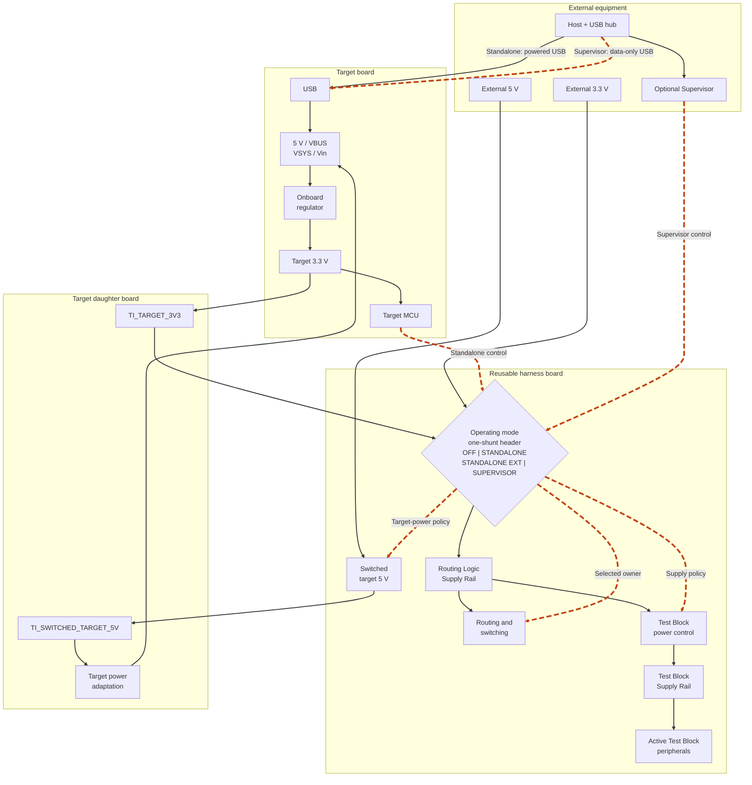

# V2 Standard Control Services

**Status:** Working draft

**Last Updated:** 18 July 2026

## 1. Purpose

This document defines the reusable services used to configure, operate,
observe and recover the V2 harness system. It begins with the Power Control
Service. Later revisions will add control-path, routing, reset, boot and
programmable-peer services.

The standard harness shall remain useful in a **Standalone** mode without a
**Harness Supervisor**. A Supervisor adds unattended control and recovery but
is not required for Standalone testing.

This document defines behaviour and practical system boundaries. Component
selection, detailed circuits and physical Target Interface contacts remain
downstream design work.

## 2. Control-Service Principles

Control Services shall start in electrically safe states without depending on
target or Supervisor software. A failed or absent controller shall not leave
an active route, competing driver or uncontrolled target supply.

The Target Profile shall state which services and owners are available. The
Resolved Test Configuration shall record the selections and observed states
needed to reproduce a test.

Target-specific USB, supply, polarity or protection arrangements are Adapter
Services on the target daughter board or documented harness accessories. They
shall not be duplicated on the reusable harness merely to accommodate one
target.

## 3. Power Control Service

### 3.1 Architecture

One grouped **Operating Mode** header coordinates the Routing Logic Supply
Rail source, control owner, Test Block Supply Rail policy and harness target
power. The header accepts one shunt in one of four clearly marked positions:

| Mode | Routing Logic Supply Rail | Control owner | Test Block Supply Rail | Target power from harness |
|---|---|---|---|---|
| `OFF` | Off | Isolated | Off | Off |
| `STANDALONE` | Target 3.3 V | Target | On | Off; normal powered USB is used |
| `STANDALONE EXT` | External 3.3 V | Target | On | Off; normal powered USB is used |
| `SUPERVISOR` | External 3.3 V | Supervisor | Supervisor-controlled, default off | Supervisor-controlled 5 V |

This removes invalid user-selected combinations while retaining externally
powered Standalone operation for development, diagnosis or a target with
insufficient spare 3.3 V capacity. The grouped-header implementation shall be
confirmed during schematic design.

### 3.2 Routing-Control 3.3 V

The Routing Logic Supply Rail shall accept either target 3.3 V or an external
regulated 3.3 V harness-system supply. The Operating Mode header shall select
one source without allowing the two supplies to be connected together.

The daughter board supplies target 3.3 V through the Target Interface on the
provisional `TI_TARGET_3V3` signal, with the common ground reference. It is an
output from the powered target into the harness mode selection, not a general
bidirectional 3.3 V rail or a target power input. Physical contact allocation
remains part of the Target Interface contract.

In `STANDALONE`, the target 3.3 V rail is expected to be established before
test code executes. Routing devices shall nevertheless enter their safe state
in hardware while the target starts. A Target Profile shall require
`STANDALONE EXT` where target 3.3 V is unavailable or cannot supply the
complete harness load.

The selected source powers the Routing Logic Supply Rail directly. The Test
Block Supply Rail is derived from it through a controlled power switch. It is
on in both Standalone modes so active Test Blocks remain available without a
software power-enable step. In `SUPERVISOR` it defaults off and is enabled only
when required. Passive Test Block connections do not require this rail.

The Operating Mode is a test precondition and shall not be changed while any
associated source is powered.

### 3.3 Standalone Operation

Standalone operation uses the target's normal powered USB connection for
power, firmware upload and console access. The target establishes and verifies
the required routes through the direct control bus.

Automated power cycling is unavailable in this arrangement. Tests that require
it shall be excluded, adapted to a manual step or run later with a Supervisor.
Recovery uses the target's normal reset, boot and USB power controls.

The routing fabric shall not be needed to establish the control bus or the
normal recovery connection. This prevents an incorrect route from blocking
the means required to correct it.

### 3.4 Supervisor-Controlled Target Power

Supervisor operation shall provide a switched 5 V target supply while keeping
the Supervisor and routing-control domain powered. The Supervisor shall be
able to place routes and peer outputs in their safe states, remove target
power, confirm the target supply state and restore power without assistance
from target firmware.

The Power Control Service provides the switched 5 V supply. The daughter board
maps that supply from a dedicated logical Target Interface power-service
connection, provisionally `TI_SWITCHED_TARGET_5V`, to the target's accepted
`5V`, `VBUS`, `VSYS` or target-specific power input. This connection is an
output from the harness to the daughter board, not a general bidirectional 5 V
rail. Physical contact allocation remains part of the Target Interface
contract.

The daughter-board mapping shall not bypass a target's intended onboard
regulation or connect the switched supply to host USB VBUS or another active
source. In Standalone operation this path remains inactive while the normal
powered USB connection supplies the target. Appendix A records the
supplier-documented external-power connection for each assessed target.

The switching implementation shall provide adequate current capacity,
reverse-current protection and predictable removal of residual target-rail
charge. Exact ratings, sensing thresholds and circuit topology remain detailed
design decisions.

### 3.5 Host USB During Controlled Power Cycling

The harness system normally uses a host-powered local USB hub. Short, marked
cables connect the hub to the target USB ports. A **USB data-only cable**
passes USB data and ground but has no VBUS power connection. It therefore
prevents the host or hub from becoming a competing target-power source.

The USB hub and USB data-only cables are harness-system equipment, not
circuitry repeated on every daughter board. A target-specific USB interposer
is an Adapter Service only where a USB data-only cable is insufficient.

For the prototype, a USB-A male screw-terminal adapter at the hub end provides
a simple reusable construction method. A target cable can retain its moulded
target connector while its USB-A end is removed; data and ground connect at
the adapter and VBUS remains disconnected. This keeps the bulky termination at
the hub and permits different target connectors and cable lengths. The
following off-the-shelf adapter is a candidate rather than a fixed component
selection: `https://www.amazon.co.uk/dp/B0CM65GY89`. Each completed cable shall
be continuity-tested and marked `USB DATA ONLY`; USB-C cables require separate
attach-detection validation.

The initial ESP32-S3 arrangement may use externally powered native USB while
the host remains connected. Standards-compliant self-powered USB attach and
detach sensing is not an initial harness capability; it may be added later as
an S3-specific Adapter Service if that behaviour needs to be tested.

ESP32-S3 USB OTG host operation additionally requires the target to supply
VBUS to the attached USB device. Its daughter board shall therefore provide an
optional, controllable VBUS Adapter Service supplied from the harness switched
5 V service. The VBUS output shall default off and prevent reverse current; it
is enabled only when the target is deliberately operating as the USB host.
The switch, current protection, control path and connector arrangement remain
daughter-board design decisions. An ordinary USB data-only cable supports the
normal device-mode host connection but does not provide this OTG-host supply.

USB VBUS isolation alone does not prove that a target is unpowered. Prototype
verification shall also check USB data, control I2C, routing, reset, debug and
peer connections for back-power paths.

### 3.6 Evidence And Verification

Power-related test evidence shall record the Operating Mode, target power
source, relevant USB data-only cable connections and Test Block Supply Rail
state. Supervisor-controlled tests shall record both the commanded and
observed target-power state.

The prototype shall demonstrate:

1. safe Standalone startup with routing powered from target 3.3 V
2. target-controlled routing from the external 3.3 V source
3. controlled enable and removal of the Test Block Supply Rail
4. safe routing and peripheral states during target power removal
5. supervised removal and restoration of target 5 V
6. absence of material back-power through every attached path
7. restoration of the selected console or USB connection after power cycling

### 3.7 Downstream Decisions

Detailed design shall select the grouped Operating Mode header circuit, 3.3 V
source connector, Test Block and target-power switches, supply ratings,
sensing method, discharge behaviour and protection components. Prototype
measurements shall determine whether any target requires USB data isolation in
addition to the data-only cable's VBUS disconnection.

Physical Target Interface contacts are not assigned by this specification.

## 4. Harness Supervisor

The optional **Harness Supervisor** is a removable, independently powered MCU
board that executes host-requested Control Service operations when they cannot
depend on responsive target firmware. It connects to the host through USB and
to the reusable harness through a dedicated Supervisor Interface. Its absence
does not prevent Standalone operation.

The Supervisor shall:

* control and verify routing when `SUPERVISOR` mode is selected
* operate target power, reset and optional boot recovery
* generate independent digital stimulus and capture target-generated timing
* provide Wi-Fi and Bluetooth functional-test peers
* when requested, return its configuration, actions, observations and
  timestamps to the host

The host runner and Target Profile determine the requested configuration. The
Supervisor executes that configuration; it does not own target-specific pin
mappings, select arbitrary routes or replace the Target Support Module. A
general-purpose hardware debug probe is not a Supervisor responsibility.

### 4.1 Programmable-Peer Service

The Harness Supervisor normally implements the Programmable-Peer Service. The
service shall provide at least one protected 3.3 V stimulus output and one
independent timestamped digital capture input. Four simultaneously usable
capture channels are the design objective for related multi-output sequences.
An initial implementation with fewer channels shall report that coverage
limitation and preserve a practical expansion path.

Stimulus shall be maintainable while the target sleeps, resets or is otherwise
unable to execute test code. Peer outputs shall default to high impedance and
shall not back-power an unpowered target or contend with a target output. Peer
routes shall be established, verified and cleared without target assistance.

### 4.2 Supervisor Interface

The Supervisor Interface is separate from the Target Interface. It shall carry
the connections needed for:

* routing-control I2C and ownership isolation
* target-power control and observation
* direct reset and optional boot control
* programmable stimulus and capture
* common ground and any required always-on power or logic reference

This is a functional inventory, not a connector or contact assignment. The
routing and combined connection-matrix work shall determine which stimulus and
capture nodes are shared with Test Blocks and which require dedicated paths.

### 4.3 Prototype Direction

An ESP32-C3-class board running a stable Espruino tool build is the current
prototype candidate because it provides a USB connection to the host, I2C
control, programmable digital I/O, Wi-Fi and Bluetooth in one replaceable
unit. The processor, firmware, connector, capture performance and host protocol
remain implementation decisions; another Supervisor may satisfy the same
service requirements. A Raspberry Pi-based Supervisor is an option for later
designs.

## Appendix A. Target Power Adaptation

The assessed targets can use the common switched 5 V service through their
supplier-documented external-power inputs. The daughter board owns the
target-specific mapping and any required source isolation.

| Target | Supplier-documented external-power connection | Daughter-board mapping |
|---|---|---|
| ESP32-C3-DevKitC-02 | `5V` and `GND` header pins | Switched 5 V to `5V` |
| ESP32 DevKitC V4 | `5V` and `GND` header pins | Switched 5 V to `5V` |
| ESP32-S3-DevKitC-1 | `5V` and `GND` header pins | Switched 5 V to `5V` |
| Raspberry Pi Pico and Pico W | `VSYS`, approximately 1.8 V to 5.5 V | Switched 5 V through a diode or reviewed source isolator to `VSYS` |
| Raspberry Pi Pico 2 and Pico 2 W | `VSYS`, approximately 1.8 V to 5.5 V | Switched 5 V through a diode or reviewed source isolator to `VSYS` |
| Espruino Pico | `Bat` / `VBAT` and `GND`; onboard regulator accepts 5 V | Switched 5 V to `Bat` / `VBAT` |
| MDBT42Q breakout | `V+` / `Vin` and `GND`; accepts 2.5 V to 16 V | Switched 5 V to `Vin` |

The Espressif development-board guides define USB, 5 V header and 3.3 V
header supply methods as mutually exclusive. Supervisor operation therefore
uses USB data-only cables when the switched 5 V header supply is active.
The ESP32-S3 daughter board also requires the optional controllable VBUS
Adapter Service defined in Section 3.5 when USB OTG host operation is tested.

The Pico-family supplier guidance recommends source isolation when USB and an
external `VSYS` source may both be present. A diode is the simple prototype
arrangement; a later daughter board may use the supplier-described P-channel
MOSFET arrangement where its lower voltage drop is useful.

The accepted MDBT42Q target is the regulated breakout board. A bare MDBT42Q
module instead requires 1.7 V to 3.6 V at `VDD` and is not covered by the
switched 5 V mapping above.

The completed compatibility targets also accept the service with documented
adaptation:

| Compatibility target | Supplier-documented external-power connection | Daughter-board mapping |
|---|---|---|
| ESP32-C3-DevKitM-1 | `5V` and `GND` header pins | Switched 5 V to `5V` |
| Seeed Studio XIAO ESP32-S3 | External input through the `5V` pin with a series diode | Switched 5 V through the documented diode arrangement to `5V` |

### A.1 Supplier References

* ESP32-C3-DevKitC-02:
  `https://docs.espressif.com/projects/esp-dev-kits/en/latest/esp32c3/esp32-c3-devkitc-02/user_guide.html`
* ESP32 DevKitC V4:
  `https://docs.espressif.com/projects/esp-dev-kits/en/latest/esp32/esp32-devkitc/user_guide.html`
* ESP32-S3-DevKitC-1:
  `https://docs.espressif.com/projects/esp-dev-kits/en/latest/esp32s3/esp32-s3-devkitc-1/user_guide_v1.1.html`
* Raspberry Pi Pico and Pico W:
  `https://datasheets.raspberrypi.com/pico/pico-datasheet.pdf` and
  `https://datasheets.raspberrypi.com/picow/pico-w-datasheet.pdf`
* Raspberry Pi Pico 2 and Pico 2 W:
  `https://datasheets.raspberrypi.com/pico/pico-2-datasheet.pdf` and
  `https://datasheets.raspberrypi.com/picow/pico-2-w-datasheet.pdf`
* Espruino Pico: `https://www.espruino.com/Pico`
* MDBT42Q breakout: `https://www.espruino.com/MDBT42Q`
* ESP32-C3-DevKitM-1:
  `https://docs.espressif.com/projects/esp-dev-kits/en/latest/esp32c3/esp32-c3-devkitm-1/user_guide.html`
* Seeed Studio XIAO ESP32-S3:
  `https://wiki.seeedstudio.com/xiao_esp32s3_getting_started/`

## Appendix B. Power Architecture Block Diagram

This diagram summarises the proposed Standalone and Supervisor power
arrangements. It shows functional connections, not physical Target Interface
or Supervisor Interface contact assignments.

Solid lines represent power paths. Wide orange dashed lines represent data or
control paths. The grouped Operating Mode header accepts one shunt and
coordinates the Routing Logic Supply Rail source, control owner, Test Block
Supply Rail policy and target-power policy.
